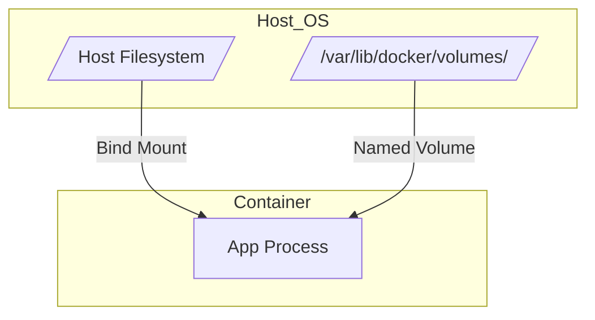

# Docker Guide

* [Official Install Guide (Debian) :simple-debian:](https://docs.docker.com/engine/install/debian/)
* [Compose File Reference :simple-docker:](https://docs.docker.com/compose/compose-file/)

---

## 1. Installation (Debian 12)

Do not use the default Debian repository packages (`docker.io`); they are often outdated. Use the official Docker repository.

### Step 1: Set up Repository

```bash
# 1. Remove conflicting packages (if any)
for pkg in docker.io docker-doc docker-compose podman-docker containerd runc; do sudo apt-get remove $pkg; done

# 2. Install prerequisites
sudo apt-get update
sudo apt-get install ca-certificates curl gnupg

# 3. Add Docker's official GPG key
sudo install -m 0755 -d /etc/apt/keyrings
curl -fsSL https://download.docker.com/linux/debian/gpg | sudo gpg --dearmor -o /etc/apt/keyrings/docker.gpg
sudo chmod a+r /etc/apt/keyrings/docker.gpg

# 4. Add the repository to Apt sources
echo \
  "deb [arch=$(dpkg --print-architecture) signed-by=/etc/apt/keyrings/docker.gpg] https://download.docker.com/linux/debian \
  $(. /etc/os-release && echo "$VERSION_CODENAME") stable" | \
  sudo tee /etc/apt/sources.list.d/docker.list > /dev/null

sudo apt-get update

```

### Step 2: Install Docker Engine

```bash
sudo apt-get install docker-ce docker-ce-cli containerd.io docker-buildx-plugin docker-compose-plugin -y

```

### Step 3: Post-Installation (Rootless)

Allow your user to run Docker commands without `sudo`.

```bash
sudo usermod -aG docker $USER
newgrp docker

```

*Verify installation:*

```bash
docker run hello-world

```

---

## 2. Core Concepts

### Storage Strategies

Data persistence is the most critical part of the setup. I use three distinct strategies depending on the data type.



| Strategy | Syntax | Description | Best For |
| --- | --- | --- | --- |
| **Standard Volume** | `volume_name:/data` | Managed by Docker. Created automatically on up. **Deleted** if you run `down -v`. | Caches, Temp data, Non-critical apps. |
| **External Volume** | `external: true` | Managed by Docker. Created manually *once*. **Persists** even if project is destroyed. | **Databases**, Critical configs (Omada, Portainer). |
| **Bind Mount** | `/host/path:/data` | Direct link to a folder on the host OS. | **Media files** (Movies/TV), Config files you edit manually. |

### Networking Strategies

| Mode | Syntax | Behavior | Use Case |
| --- | --- | --- | --- |
| **Bridge** | (Default) | Container gets its own IP. Ports must be mapped (`-p 80:80`). Isolated. | Most web apps (Homepage, Sonarr). |
| **Host** | `network_mode: host` | Container shares the Host's IP and ports directly. No isolation. | **Omada Controller**, Plex (for DLNA/Discovery). |

---

## 3. Directory Structure

I organize stacks by "project" folders. Each folder contains its own `docker-compose.yml`.

```text
/home/user/docker/
├── core/                  # Infrastructure (Portainer, Homepage)
│   └── docker-compose.yml
│
├── media/                 # Content (Plex, *arrs)
│   └── docker-compose.yml
│
├── monitoring/            # Observability (Beszel)
│   └── docker-compose.yml
│
└── omada/                 # Network Controller
    └── docker-compose.yml

```

---

## 4. Configuration Examples

### A. The "Safe" Database Stack (External Volume)

*Prevents accidental data deletion.*

```yaml title="omada/docker-compose.yml"
services:
  controller:
    image: mbentley/omada-controller:latest
    network_mode: host
    volumes:
      - omada_data:/opt/tplink/EAPController/data
      - omada_logs:/opt/tplink/EAPController/logs

# Tells Compose: "Expect these to exist. Do not create or delete them."
volumes:
  omada_data:
    external: true
  omada_logs:
    external: true

```

*Requirement:* Run `docker volume create omada_data` once before starting.

### B. The Media Stack (Bind Mounts)

*Links to massive storage arrays on the host.*

```yaml title="media/docker-compose.yml"
services:
  plex:
    image: lscr.io/linuxserver/plex:latest
    network_mode: host
    volumes:
      # CONFIG: Uses a standard volume for speed/metadata
      - plex_config:/config
      # MEDIA: Direct access to the RAID array on the host
      - /mnt/storage/movies:/movies
      - /mnt/storage/tv:/tv

volumes:
  plex_config:

```

---

## 5. Cheat Sheet

### Lifecycle Management

| Command | Action |
| --- | --- |
| `docker compose up -d` | Start/Update the stack in the background. |
| `docker compose down` | Stop containers and remove networks. |
| `docker compose pull` | Download newer images for defined services. |
| `docker compose logs -f` | Stream logs for all services in this folder. |
| `docker system prune -a` | **Cleanup:** Delete all stopped containers and unused images. |

### Volume Management

| Command | Action |
| --- | --- |
| `docker volume create <name>` | Create a volume (Required for `external: true`). |
| `docker volume ls` | List all volumes. |
| `docker volume inspect <name>` | Find the actual path on the disk (Mountpoint). |

!!! danger "The Destructive Command"
`docker compose down -v`

```
This command stops containers AND **deletes all standard volumes**. Only use this if you truly want to wipe the slate clean. It will *not* delete `external: true` volumes.

```